# Dokumentacja

Ten projekt jest napisany w języku **Python** za pomocą wieloplatformową bibliotecy do tworzenia interfejsów użytkownika [Qt](https://www.qt.io/) zaimplementowanej za pomocą biblioteki Python [PyQt5](https://pypi.org/project/PyQt5/)  

Mam 2 egzemplarza aplikacji: Dla MacOS i dla Windows, więc proszę ściągnąć odpowiedni program.

>Opisuje pokrótce zasady wdrażania i korzystania z aplikacji.


## Spis treści

- [Dokumentacja](#dokumentacja)
- [Spis treści](#spis-treci)
- [Analiza algorytmów](#analiza-algorytmow)
  - [Bucket sort](#bucket-sort)
  - [Bubble sort](#bubble-sort)
  - [Insertion sort](#insertion-sort)
  - [Quick sort](#quick-sort)
  - [Selection sort](#selection-sort)
- [Instrukcja użytkowania](#instrukcja-uzytkowania)
- [Ważne punkty wdrożenia](#wazne-punkty-wdrozenia)
- [Wyniki testowania](#wyniki-testowania)
- [Wnioski z realizacji projektu](#wnioski-z-realizacji-projektu)
- [Samoocena](#samoocena)


## Analiza algorytmow

Musiłaem zrobić tylko dwa algoritmy: Bubble sort i Bucket sort. Ale zrobilem aż pięc algorytmów (3 dodatkowych): Insertion sort, Selection sort i Quick sort.

### Bucket sort

Bucket sort jest zrobiony na bazie Insertion sort, gdzie sortuje mały listy (bucket)

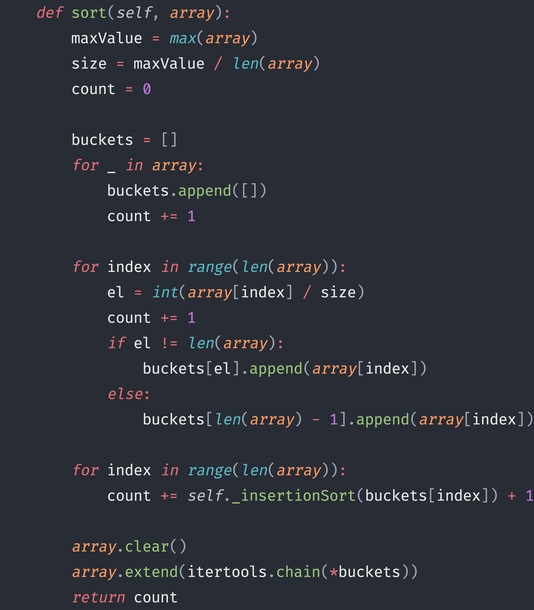

1. Pamięciowy koszt: `S(n) = n + O(1) = n + 1`
2. Operacja dominuącja: `if el != len(array)`
3. Czasowy koszt t(n):
    1. Liczba powtórzeń instrukji `for`:
        1. ```python
           for _ in array:
               ...
            ```
        2. ```python
           for index in range(len(array)):
               ...
            ```
        Równa `2 * n`
    2. Liczba operacji dominujących:
        ```python
       for index in range(len(array)):
            el = int(array[index] / size)
            count += 1
            if el != len(array):
                buckets[el].append(array[index])
            else:
                buckets[len(array) - 1].append(array[index]) 
        ```
        Wykonana `n` raz
        
    Więc `t(n) = ((n * 1) / k) + ((n(n - 1) * 1) / k ^ 2) = (n ^ 2 + n * k -n) / k ^ 2`, gdzie `k ~= n`, ale w tej realizacji algorytmu możemy to zapisać po prosy tak: `t(n) = 3*n` 


### Bubble sort

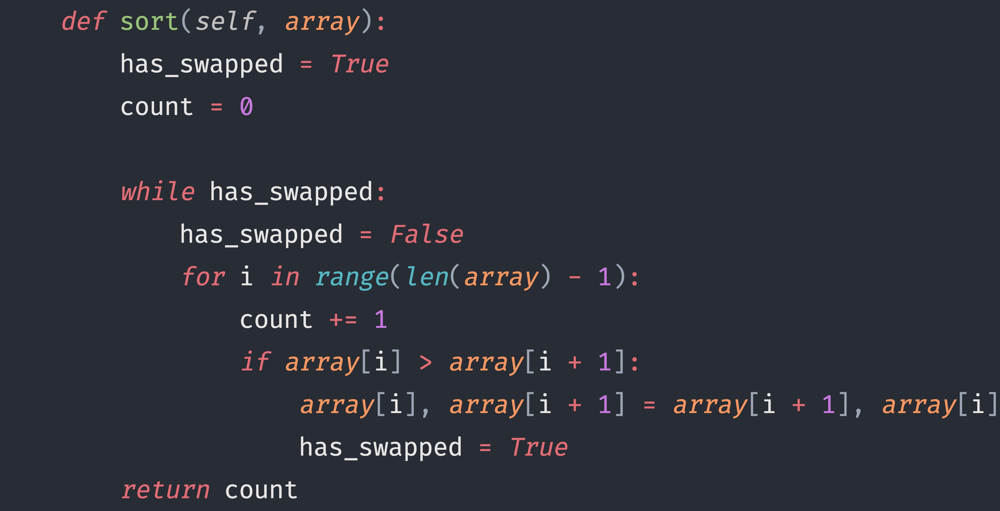

1. Pamięciowy koszt: `S(n) = n + O(1) = n + 1`
2. Operacja dominuącja: `if array[i] > array[i + 1]`
3. Czasowy koszt t(n):
    1. Liczba powtórzeń instrukji `while`:
        ```python
        while has_swapped: 
           ...
        ```
        Wykonano co najwyżej `(n - 1)` raz
    2. Liczba operacji dominujących:
        ```python
       for i in range(len(array) - 1):
            count += 1
            if array[i] > array[i + 1]:
                array[i], array[i + 1] = array[i + 1], array[i]
                has_swapped = True
        ```
        Wykonana `(n - 1)` raz
        
    Z formuly `S(n) = (a1 + an) / 2 * n` wycieka
    `t(n) = (1 + (n - 1)) / 2 * (n - 1) = (n * (n - 1)) / 2`
    
    Więc `t(n) ~= O(n^2)`


### Insertion sort

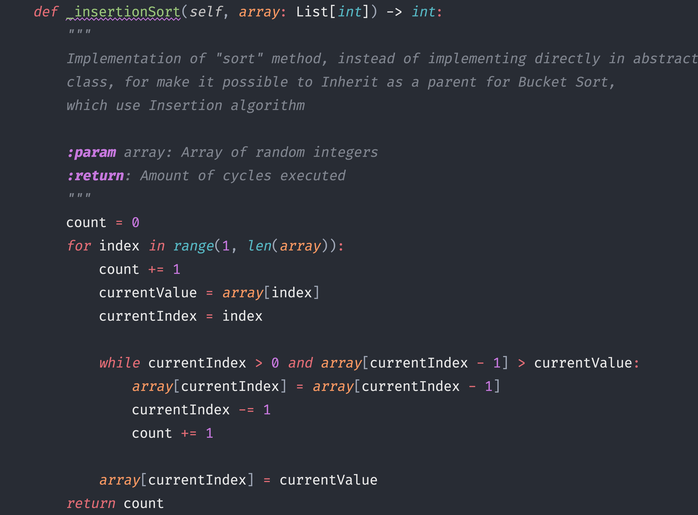

1. Pamięciowy koszt: `S(n) = n + O(1) = n + 1`
2. Operacja dominuącja: `array[currentIndex - 1] > currentValue`
3. Czasowy koszt t(n):
    1. Liczba powtórzeń instrukji `for`:
        ```python
       for index in range(1, len(array)):
           ...
        ```
        Równa `(n-1)`
    2. Liczba operacji dominujących:
        ```python
       while currentIndex > 0 and array[currentIndex - 1] > currentValue:
            array[currentIndex] = array[currentIndex - 1]
            currentIndex -= 1
        ```
        Wykonana co najwyżyszej `currentIndex - 1` raz
        
    Z formuly `S(n) = (a1 + an) / 2 * n` wycieka
    `t(n) = (1 + (n - 1)) / 2 * (n - 1) = (n * (n - 1)) / 2`
    
    Więc `t(n) ~= O(n^2)`
    


### Quick sort

Wykonany za pomocą dwóch metod: która sortuje i która dzieli listy

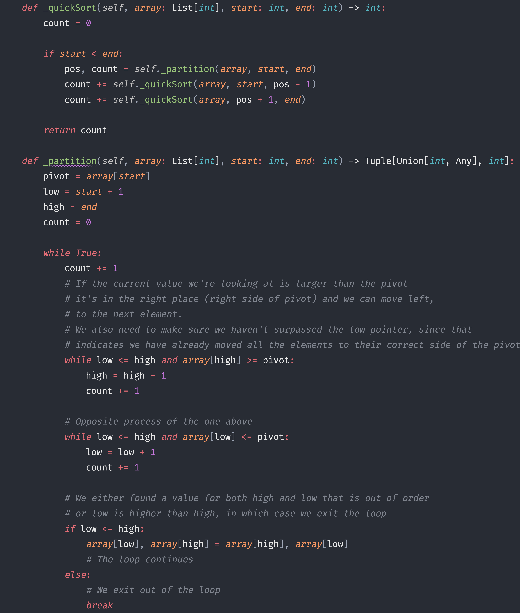

1. Pamięciowy koszt: `S(n) = n + O(n - 1) = 2n - 1`
2. Operacja dominuącja: `if array[j] < array[minIndex]`
3. Czasowy koszt t(n): `t(n) = n * (k + 1) = n * (log2(n) + 1)`

### Selection sort


1. Pamięciowy koszt: `S(n) = n^2 + O(1) = n^2 + 1`
2. Operacja dominuącja: `if array[j] < array[minIndex]`
3. Czasowy koszt t(n):
    1. Liczba powtórzeń instrukji `for`:
        ```python
       for index in range(1, len(array) - 1):
           ...
        ```
        Równa `(n-1)`
    2. Liczba operacji dominujących:
        ```python
       for j in range(index + 1, len(array) - 1):
            if array[j] < array[minIndex]:
                minIndex = j
        ```
        Wykonana co najwyżyszej `index - 1` raz
        
    Więc `t(n) ~= O(n^2)`


## Instrukcja uzytkowania

Po urochomeniu programu mamy taki widok


1. W prawym górnym rogu znajdują się wszystkie kontrolki i pola wejściowe.
2. Na dolu ekranu znajduje się status bar, który powiadamia użytkownika o jego działaniach w programie.
3. Na górze znajduje się menu, w którym można zresetować program i ustawić dekoracje dla wykresów.
4. W srodku bedą wyświtlany wyniki sortowania (tablicy i wykresy)

W zakładzce "Ustawenia" są 4 parametry, które mają wpływ na sposób sortowania.


1. Ilość powtórzeń dla każdego rozmiaru
2. Maksymalny rozmiar tablicy
3. Dolna granica tablicy
4. Górna granica tablicy

Również możemy wybrać algorytm sortowania:
1. Bucket sort
2. Bubble sort
3. Insertion sort
4. Quick sort
5. Selection sort

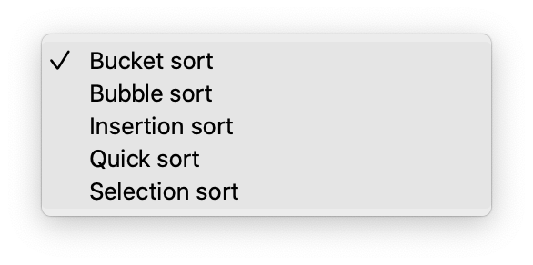

---

Kontrolki "Tablica przed sortowaniem" i "Tablica po sortowaniu" wyświetlają odpowiednie tablicy z wartościami in indeksami.

Przed sortowaniem 


Po sortowaniu

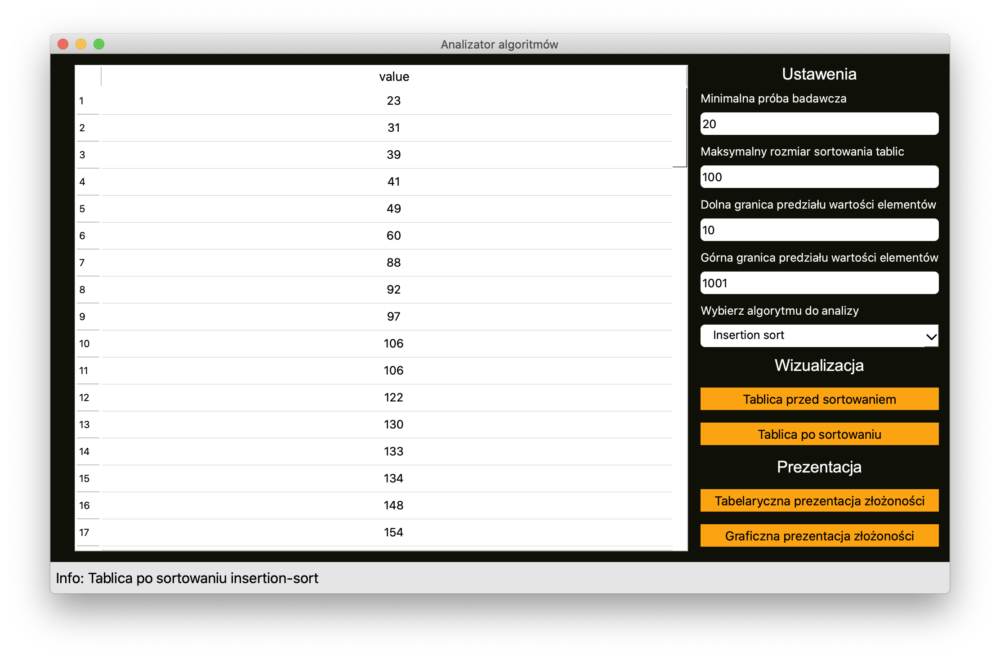

---

Kontrolka "Tabelaryczna prezentacja złożoności" wyświetli tablicę z parametrami:
1. Rozmiar tablicy (n)
2. Czas sortowania tablice, s * 10-E6 (w micro sekundach)
3. Analityczny czas sortowania, O(n)
4. Koszt pamięciowy, S(n)

>Po naciśnieciu, Status bar wyświetli, że zaczyna obliczenie. Proszę nie klikać na kontrolki w trakcie obliczenia!

 

Wyniki analiztora w formacie tablicy

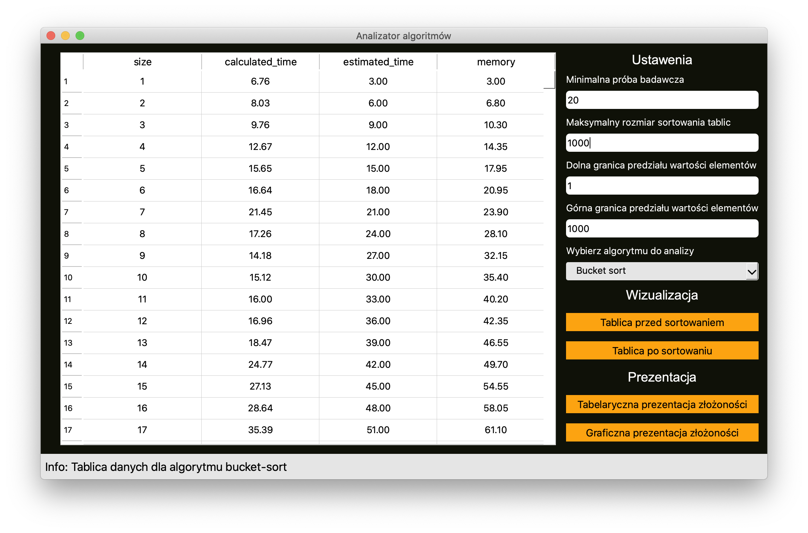

---

Kontrolka "Graficzna prezentacja złożoności" wyświetli wykres z trzуma liniami (x, y):
1. Rozmiar tablicy (n) od Czasu sortowania (micro sekundy)
2. Rozmiar tablicy (n) od Analitycznego czasu sortowania (O(n))
3. Rozmiar tablicy (n) od Kosztu pamięciowego (S(n))

>Po naciśnieciu, Status bar wyświetli, że zaczyna obliczenie. Proszę nie klikać na kontrolki w trakcie obliczenia!

 

Wyniki analizatora w formacie wykresu

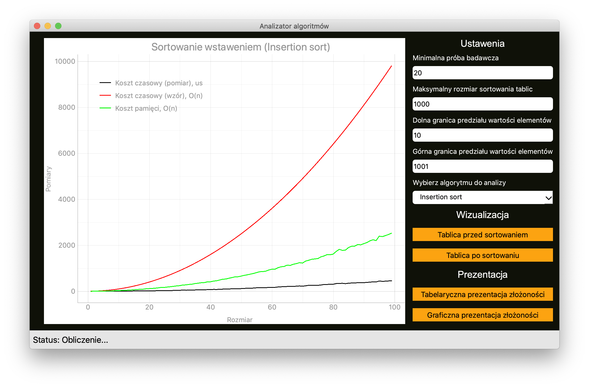 


Można zmienić dekoracji w zakładzie menu ([opis](#instrukcja-uytkowania))


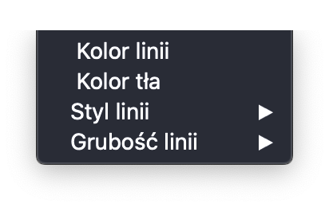 
 
 
Żeby zresetować program w zakladzie menu kliknij "Resetuj" ([opis](#instrukcja-uytkowania))

 

 


## Wazne punkty wdrozenia

Tu mam abstrakcyjną klasę bazową "Algorithm", która tworze interfejs do realizacji do wszystkich innych algoritmów. To jest biznes logika aplikacji. Bardzo ciekawe są metody `sort` i `calculate`.

Metoda `sort` realizuje się interfejs dla sortowania listy.
Metoda `calculate` oblicza slownik danych dla tablicy i wykresu.

 

---

Również mam bardzo ciekawy tak zwany w języku Python "Decorator" (czyli po prostu obwoluta do funkcji)

On oblicza czas wywołania funkcji:
Od razu zaczyna timer, potem wywoła funkcję, potem zatrzyma timer i zwraca koszt pamięci i czas.

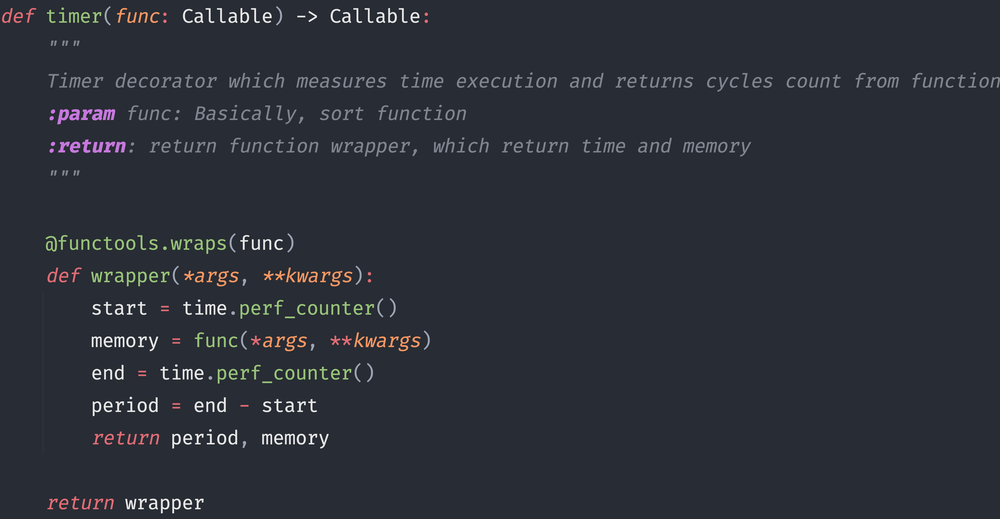

## Wyniki testowania

### Testowanie ustawień

 

 

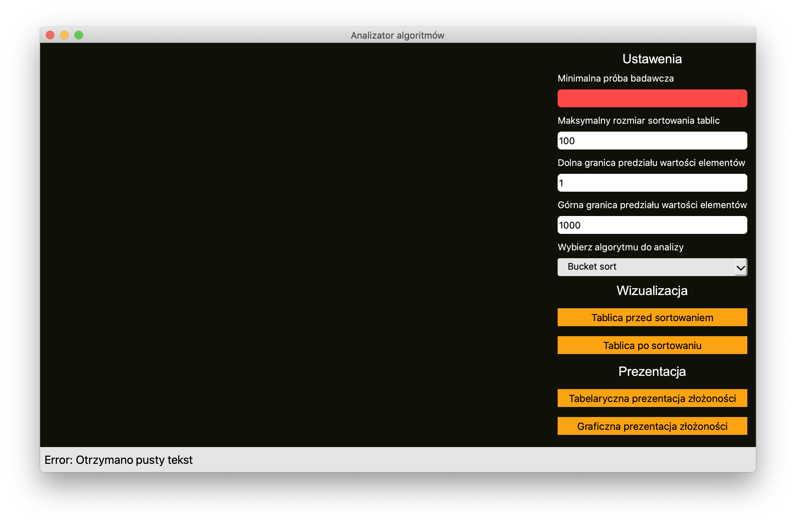 

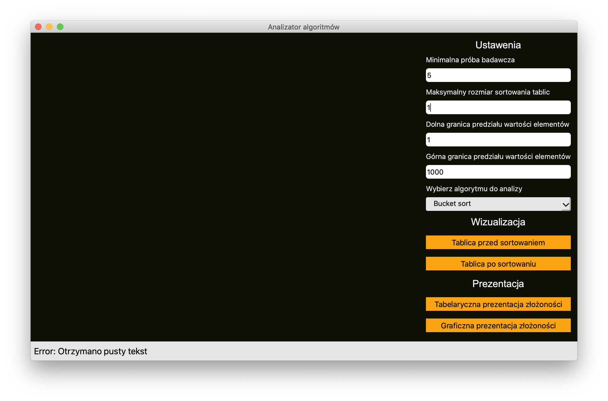 

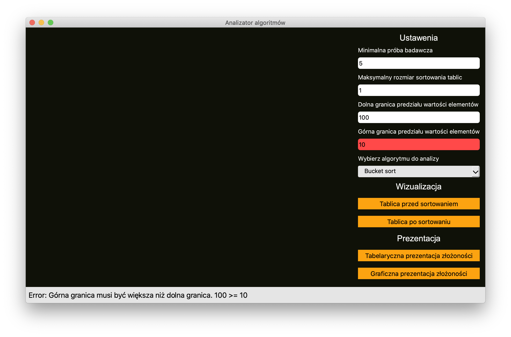 

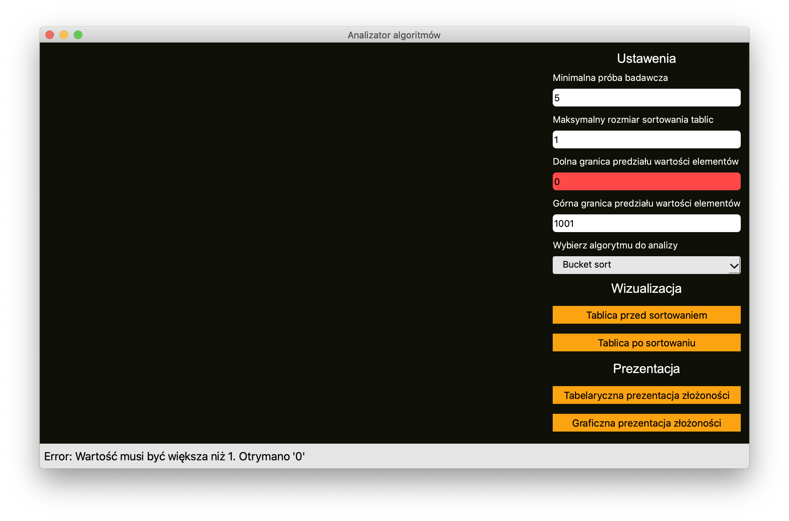 


### Testowanie sortowania tablic


 

 

 

### Testowanie analizy wykresów


 

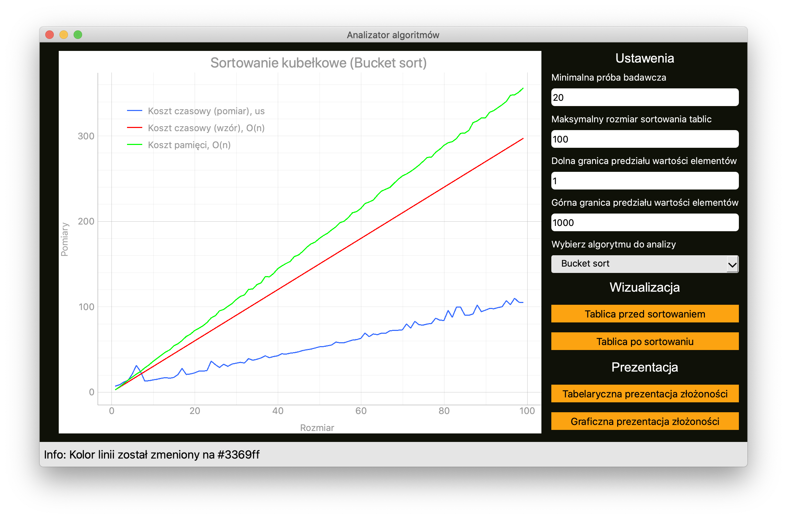 

 

 

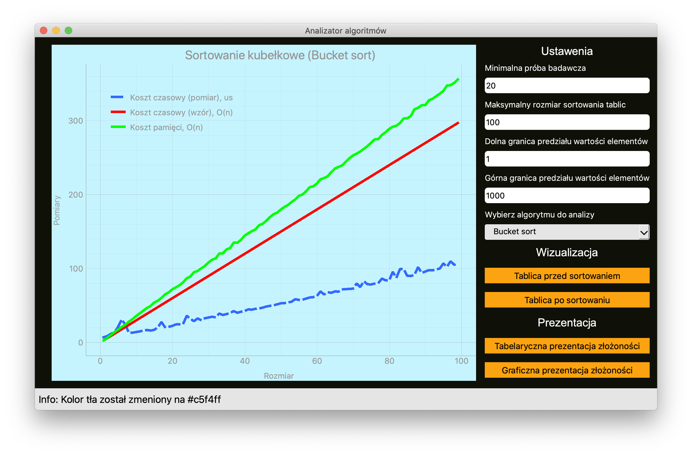 


### Testowanie analizy tablice

 

 

 

### Testowanie resetowania

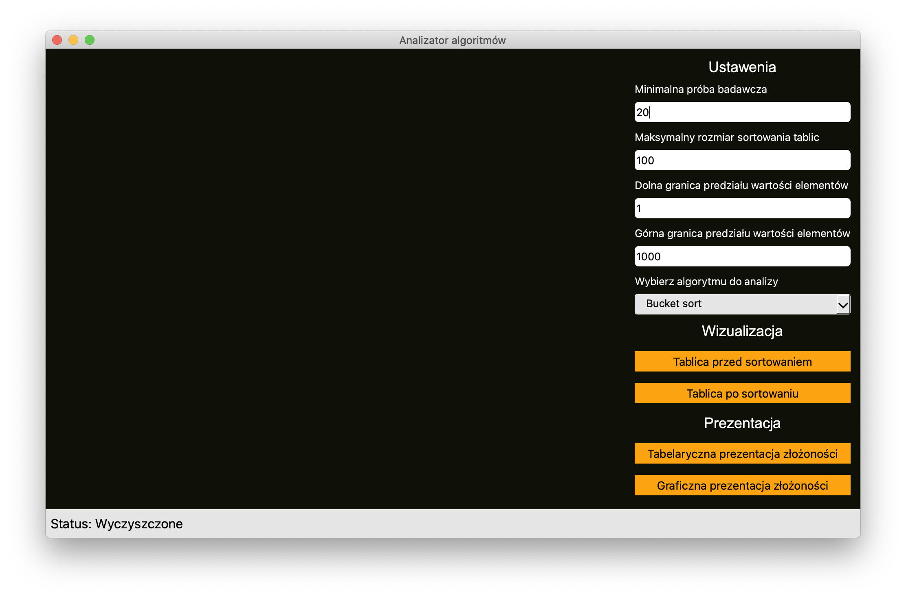 

## Wnioski z realizacji projektu

Ewentualne lepiej poznałem wzór projektowania aplikacji Model-View-Controler, czyli MVC. Ten wzór ulatwia tworzenie aplikacji, bo zawsze wiesz gdzie umieścić odpowiedni kod.

Również poznałem lepiej asynchroniczność w aplikacjach, bo tworziłem asynchroniczniczne obliczenie danych to tablicy i wykresów.


## Samoocena

Oceniam swój projekt na 5, bo mam bardzo piękną, schludną i przemyślaną architekturę aplikacji i klas. Równięz zrobiłem (w mojej opinii) piękny i wygodny interfejs użytkownika.

No i dokumentacja jest dość szczegółowa na opis i testy, więc myślę że zasluguję na taką ocenę :)

